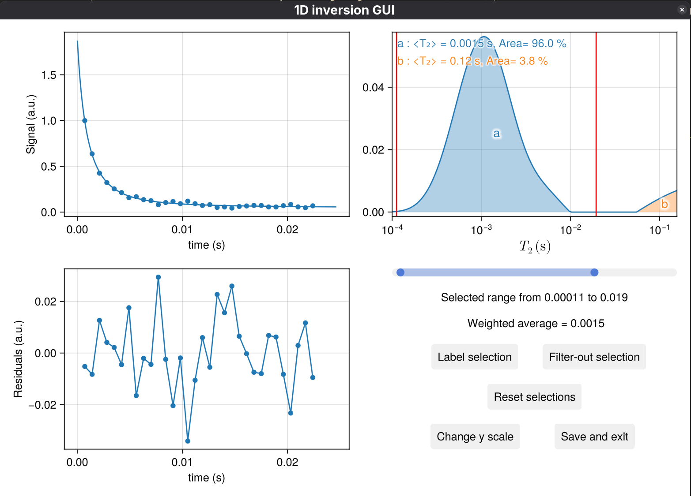
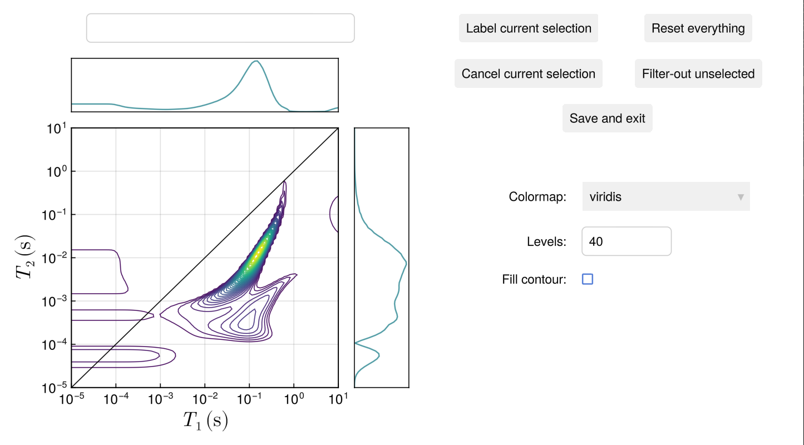
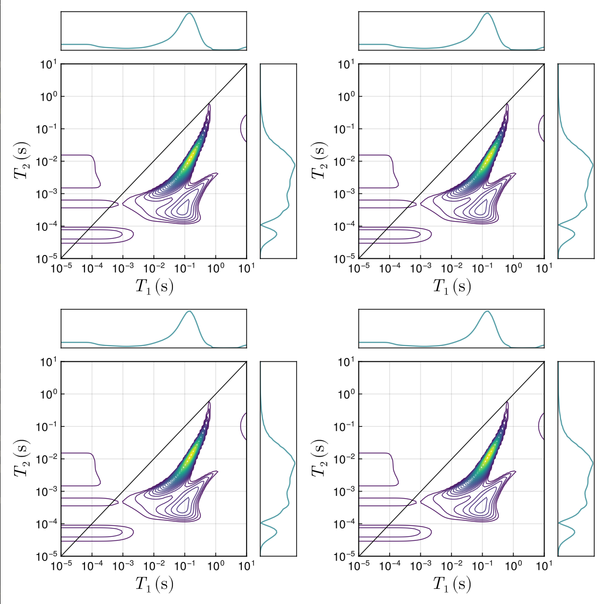
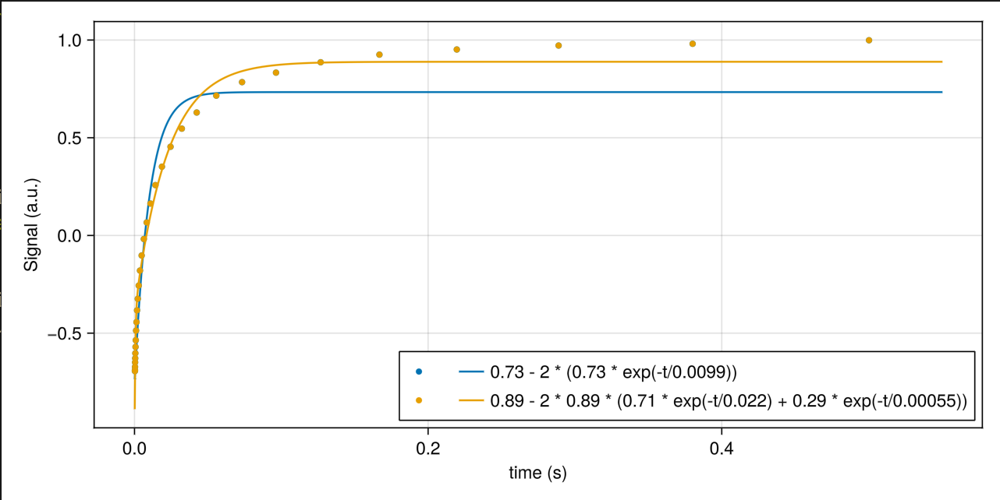

This page will give you a basic idea about how to use the NMRInversions package.
For more details, it's best to refer to the [functions](functions.md) page.

!!! hint
    All of the commands mentioned below should be typed in the julia console, 
    or saved in a text file with the .jl extension, to be used 
    from a terminal with `julia file.jl`, or through an IDE such as VSCode.


## Performing an inversion

Suppose we're working with data coming from a Spinsolve instrument 
(you can find some example data in 
[here](https://github.com/aris-mav/NMRInversions.jl/tree/master/example_data)).

!!! info
    If you want to work with different data, have a
    look [in this section](functions.md#Importing data) 
    for available functions. If your instrument 
    manufacturer is not mentioned, [submit an
    issue](https://github.com/aris-mav/NMRInversions.jl/issues)
    and we can work on it!

Then we can do the following:


```julia
using NMRInversions

data = import_spinsolve()
```

This will put all the necessary information from
your data file(s) into a variable named `data`.
You could name it whatever you like, e.g.
`a`, `sample_231`, etc.

!!! info
    Since we called the `import_spinsolve` function without an argument, 
    it'll open a file dialog for us to select the files we want to import.
    (note that `import_spinsolve` requires two files, the `aqcu.par` file
    containing aqcuistion parameters, plus the `.dat` or `.csv` file 
    containing the experiment data.)

Now we have the data imported, the inversion can
be performed using a single line of code!
Just pass the variable containing the data into
the `invert()` function.

```julia
results = invert(data)
```

!!! info
    The `results` variable above is an `inv_out_1D` or `inv_out_2D` structure, 
    which contains all the relevant information produced by the `inversion` function.
    To access that information, we can look at the fields of the structure using the 
    [dot notation](https://docs.julialang.org/en/v1/manual/types/#Composite-Types) 
    (e.g., `results.SNR` will return the value stored in the `SNR` field).
    The field names contained in the structure can be shown by using the REPL "help mode" 
    (type ? at the julia> prompt), and entering the variable's name (in this case, `?results`, 
    where `results` is whatever you chose to name that variable). 
    Alternatively, running `@doc results`  will also give you the same answers.

The results can easily be visualised through the GLMakie extension of the package.

```julia
using GLMakie
plot(results)
```
This will open a GUI with tools to interactively extract some information from the inversion results,
by selecting regions and labelling them accordingly.

!!! info
    The `plot` function of GLMakie is modified by this package 
    to work with results from the invert function as arguments.
    It's really easy to use, but if you want more control 
    on how your plots look, it's best to create them from scratch 
    using all the tools available in GLMakie.

The process above can also be achieved by a single line of code:
```julia
using NMRInversions, GLMakie
plot(invert(import_spinsolve()))
```


!!! tip
    If you want a "quick and dirty" way to exclude
    some unwanted data points from your imported data, 
    you may use indexing notation on the `input1D`and 
    `input2D` structures, just like you would on any 
    Julia array! That can be very useful if some points
    are noisy.

    !!! details "Click this box to see examples."
        Indexing works for 1D data:

        - `invert(data[n:end])`, will exclude the first 
            `n` number of points and pass all the remaining 
            ones to the `invert` function. 

        - `data[3:end-2]` excludes the first 3 and last 2 data points. 

        - `data[1:2:100]` uses the 1st, 3rd, 5th, 7th, ... , 99th data points.

        and for 2D data:

        - `data[3:end-2, :]` excludes the 3 first and
            last 2 data points in the direct dimension, and
            includes all points (`:`) on the indirect dimension.


Note that the workflow above can work for both 1D and 2D inversions!

## Examples with plots

This is how some full examples would look like:

```julia
using NMRInversions, GLMakie

path = ".../NMRInversions.jl/example_data/csv_files/graphene_CPMG.csv"
data = import_csv(IR, path)
results = invert(data)
plot(results)
```
The resulting plot will look like:



Notice that benath the ``T_2`` distribution there's a slider.
You can move the ends of it to select a region within the limits
defined by the red veritical lines.
Then you can use the following options:
- `Label current selection` will highlight the selected region 
  and add some text in the plot with the weighed average ``T_2``
  of that region.
- `Filter-out selection` will remove the selected region 
  from the distribution, and it will update the fit and the residuals 
  accordingly on the plot.
- `Reset selections` gets you back where you started, removes any 
  selections and brings back filtered-out regions.
-  `Change y scale` will change the 1st plot from linear scale to log 
   scale and back. Only works if there are no negative values (so it will 
   not work for inversion recovery data).
- `Save and exit` will bring up a window so that you can save your 
   plot as a .png (without the buttons and the slider).

Let's look at a 2D example as well:


```julia
using NMRInversions, GLMakie

paths = [".../NMRInversions.jl/example_data/spinsolve_IRCPMG/T1IRT2.dat",
         ".../NMRInversions.jl/example_data/spinsolve_IRCPMG/aqcu.par"]
data = import_spinsolve(paths)
results = invert(data)
plot(results)
```


Similarly, now we can select regions by left-clicking at points within 
- `Label current selection` will highlight the selected polygon 
  with a dashed line and add some text in the plot with the weighed 
  average ``T_1/T_2`` of that region, as well as the volume fraction of it.
- `Filter-out selection` will remove everything inside the selection polygon.
- `Cancel current selection` will discard the current polygon in 
   case you do not like what you selected.
- `Reset selection` will remove all the selections you made.
- `Reset filter` will undo anything you filtered-out.
- `Save and exit` will bring up a window so that you can save your 
   plot as a .png (without the buttons).

After making some selections, the
[weighted_averages](functions.md#Miscellaneous)
function can be used to get some information about
them.

There are also some options to change the appearance of the plot, in 
terms of colormap, contour levels and toggling between filled and non-filled
contours. You can also add a title to the plot, which will be saved.

If you have multiple results, you can pass them as a matrix or vector 
into the `plot()` function as:

```julia
plot([results  results ; results results])
```


Of course, it would be more interesting if it wasn't four
copies of the same results, but you get the point.

## Using the expfit function

In a similar way, we can perform various exponential 
fits with the imported data using the `expfit` function.

```julia
using NMRInversions, GLMakie

path = ".../NMRInversions.jl/example_data/csv_files/Chesire_sandstone_IR.csv"
data = import_csv(IR, path)

a = expfit(1, data)  # mono-exponential fit
b = expfit(2, data)  # bi-exponential fit

plot(a,b)  # Visualize both on the same plot
```


Of course, these fits are not very good, that's why we'd use inversions 
instead.
